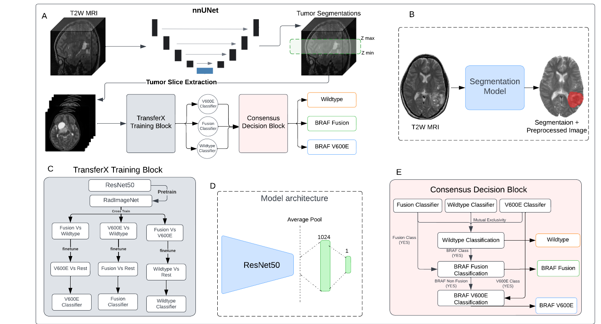

# BRAF Subtype Mutation CLassification 
> This repository contains the implementation of the scan-to-prediction pipeline for non-invasive molecular subtype classification from paper [[link here](https://www.medrxiv.org/content/10.1101/2023.08.04.23293673v4)]  .




---

## Table of Contents
- [Installation](#installation)
- [Usage](#usage)
- [Features](#features)


---

## Segmentation
For the tumor segmentation component, please refer to our dedicated repository [pLGG_Segmentation_docker](https://github.com/AIM-KannLab/pLGG_Segmentation_docker). This repository contains the complete implementation of our expert-level pediatric brain tumor MRI segmentation model, including Docker containerization for easy deployment.

The segmentation pipeline performs two key preprocessing steps:
1. Registration of the T2W MRI to a standard space and skull stripping 
2. Segmentation of the tumor from the preprocessed T2W MRI 

After running the segmentation pipeline, you will obtain both the preprocessed T2W MRI and its corresponding tumor segmentation mask, which are required for the subsequent classification steps.

To proceed with the molecular subtype classification, install the required environment:
```shell
conda env create -f 2d_approach.yml
```

## Usage 

The pipeline processes a single T2W nifti image and its corresponding segmentation mask at once. Follow these steps to run the classification:

1. Activate the classification environment:
```shell
conda activate 2d_approach
```

3. Extract tumor slice indices from the segmentation:
```shell
python get_min_max.py --image path/to/your/t2w_image.nii.gz --mask path/to/your/segmentation_mask.nii.gz
```

4. Prepare the sliced data for classification:
```shell
python get_BRAF_data_v2.py
```

5. Run the classification models:
```shell
# Wildtype classifier
python pLGG/main2.py --saved_model tumor__wildtype_radimagenet_fusion_crosstrain_fullimage_internaltestasvalidationResNet50_imagenet_23_0.73.h5 --subtype wildtype

# Fusion classifier
python pLGG/main2.py --saved_model tumor_fusion_radimagenet_fullimage_internaltestasvalidationResNet50_imagenet_21_0.75.h5 --subtype fusion

# V600E classifier
python pLGG/main2.py --saved_model tumor_v600e_radimagenet_wildtypecrosstrain_filteredv600e_fullimage_internaltestasvalidationResNet50__35_0.73.h5 --subtype v600e
```

6. Generate consensus decision:
```shell
python consensus.py
```

7. Get final classification result:
```shell
python pLGG/decision.py
```

The final classification output will be printed on the terminal screen along with the running logs. 


